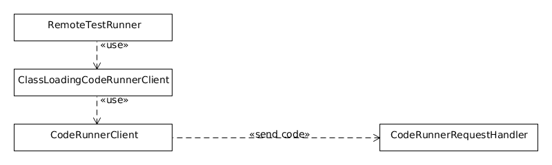

# Remote-jUnit

Run jUnit tests on a remote machine / JVM.

* uses java serialization and HTTP for communication
* load classes from local machine (remote class loading)
* embeddable and integratable server, no separate port needed
* minimal footprint server (3 public classes), no dependencies except nanohttpd which consists of a single class

## Getting started

Create a server class

    public class Server {
    
        public static void main(String... args) {
            new CodeRunnerStandaloneServer().startAndWait();
        }
    }

and a unit test using the `RemoteTestRunner`

    @RunWith(RemoteTestRunner.class)
    public class SimpleJUnitTest {
    
        @Test
        public void simple() {
            assertEquals("foo", "foo");
        }
    }

Now, start the server and run the unit test. The test will be executed in the server JVM. 
 
## Server Usage

The server is a generic server to inject an run code in a JVM. It is implemented by the `CodeRunnerRequestHandler` which handles requests and returns responses in the form of byte arrays.
 
This allows you to integrate the server in any way you need. You can easily implement a `Servlet` or integrate it with your web framework.

In addition, there is the `CodeRunnerStandaloneServer`, which starts a nanohttpd server, listening on a specific port (4578 by default)

## RemoteTestRunner Usage

To run a test remotely, simply annotate it with the `@RunWith(RemoteTestRunner.class)`. You can set the test runner to be used using the `@Remote(runnerClass=...)` and the URL to connect to (where the server is listening) using the `@Remote(endpoint=...)` annotation. 

The specified endpoint can be overridden by the `junit.remote.endpoint` system property. If set to `-` or if the server cannot be reached, the tests are executed locally. This makes it easy to use the unit tests from maven, since no server start/stop has to be managed.

## Architecture
Remote JUnit uses an architecture with 3 Layers.

The `CodeRunnerClient` simply sends a `RequestHandlingServerCode` instance along with a fixed set of class definitions to the server, where the code will be executed.

The `ClassLoadingCodeRunnerClient` uses the `CodeRunnerClient` to start a some `RequestHandlingServerCode` and establish a bi-directional message channel with it. A `MessageHandlingServerCode` is sent along and loaded using a custom class loader. Using the message channel, missing class definitions are requested by the custom class loader from the client. In addition, custom messages can be exchanged with the `MessageHandlingServerCode`.

Finally, using this infrastructure the `RemoteTestRunner` executes unit tests on the server, forwarding the JUnit test run notifications back to the client.

See the javadoc for `CodeRunnerClient`, `ClassLoadingCodeRunnerClient` and `RemoteTestRunner` for details.